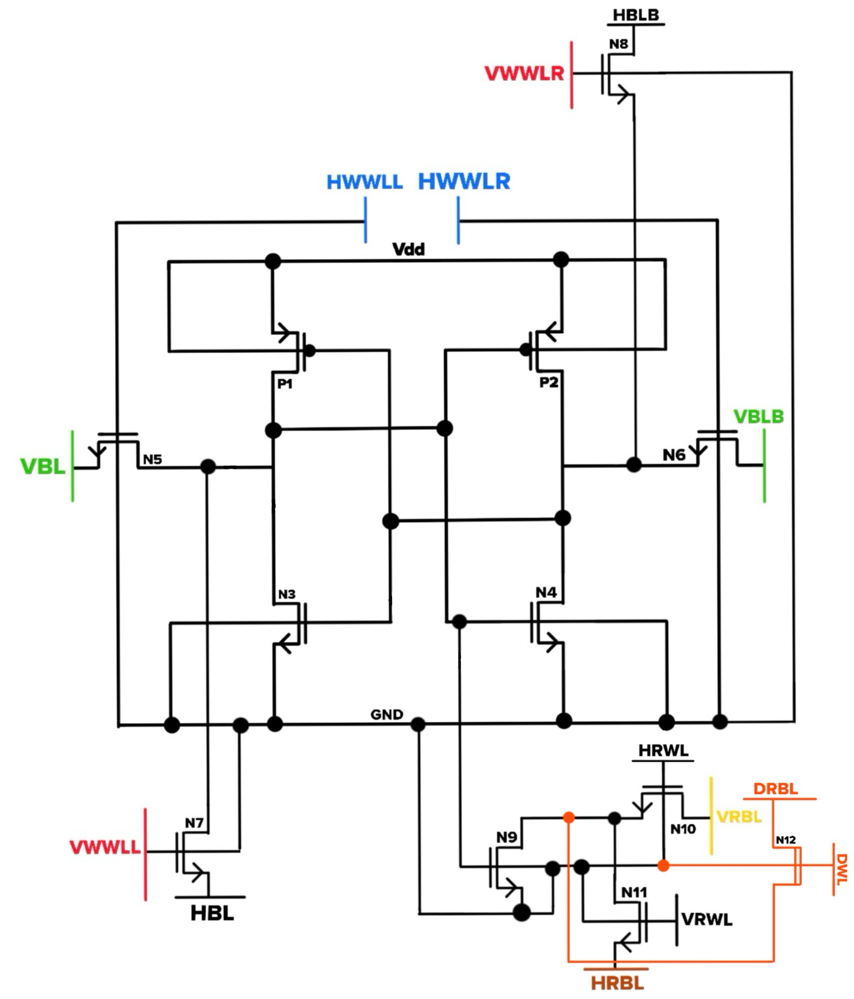

# Tri-Directional Fabric (TDF) using 12T SRAM for Image Processing

This repository contains the implementation of **Tri-Directional Fabric (TDF)**, a novel **12T SRAM-based in-memory computing architecture** that enables **row, column, and diagonal data access** inside the memory array.  
This eliminates costly **data transposition** for 2D image workloads and accelerates common kernels such as:

- Morphological Dilation  
- Sobel Operator  
- Unsharp Masking  

## 🚀 Key Contributions
- ✔️ Designed a modified **12T SRAM cell** enabling tri-directional bitline access.  
- ✔️ Proposed a **TDF-IMC architecture** for 2D convolutions without external transpose operations.  
- ✔️ Implemented and simulated using **Verilog + Cadence Virtuoso** in **45nm CMOS**.  
- ✔️ Achieved **1.77× speedup** over CPU and **56.38% energy savings** via post-layout simulations.

---

## 🧰 Tools & Technologies
| Category | Tools |
|--------|-------|
| RTL & Simulation | Verilog, Synopsys VCS |
| Circuit & Layout | Cadence Virtuoso |
| Technology | 45nm CMOS PDK |
| Workloads | Image Processing Kernels |


---

## 🖼️ Architecture Overview
(Add a PNG in `/images` and display it here)

```markdown

